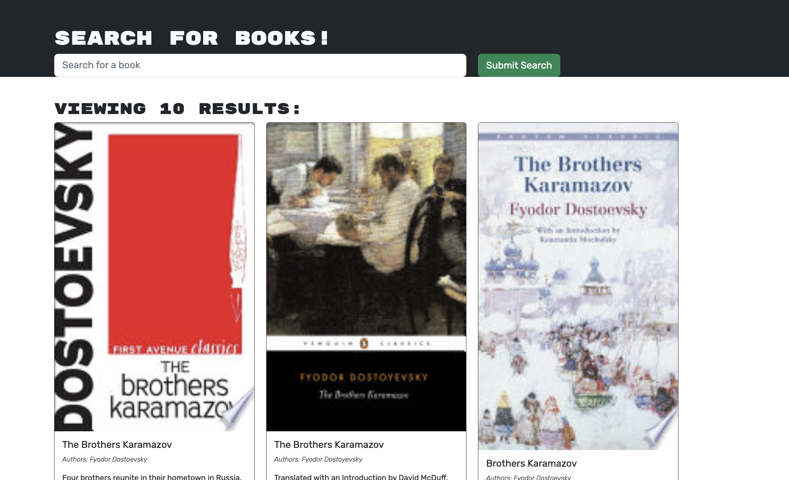

# book-search 

## Table of Contents

1. [Description](#description)
2. [Installation](#installation)
3. [Usage](#usage)
4. [Screenshot](#screenshot)
5. [Testing](#testing)
6. [Contributors](#contributors)
7. [License](#license)
8. [Questions](#questions)

## Description 

This is a program that allows you to search for and save books. You can also delete them!

## Installation 

It isn't, just navigate to https://booksearch-322.herokuapp.com/ and begin searching

## Usage 

Just open the website in your browser https://booksearch-322.herokuapp.com/

## Screenshot 

## Testing 

Just click around and verify that everything works

## Contributors 

Starter code was supplied by EdX, but I switched it from a RESTful API to an Apollo server

## License 

This is a program that allows you to search for and save books. You can also delete them!

## Questions 

Philip Scott Neumann

https://github.com/moviefan322

philman202@yahoo.com
